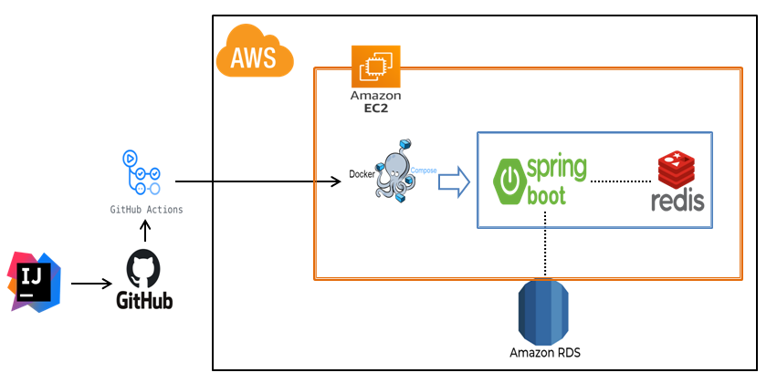
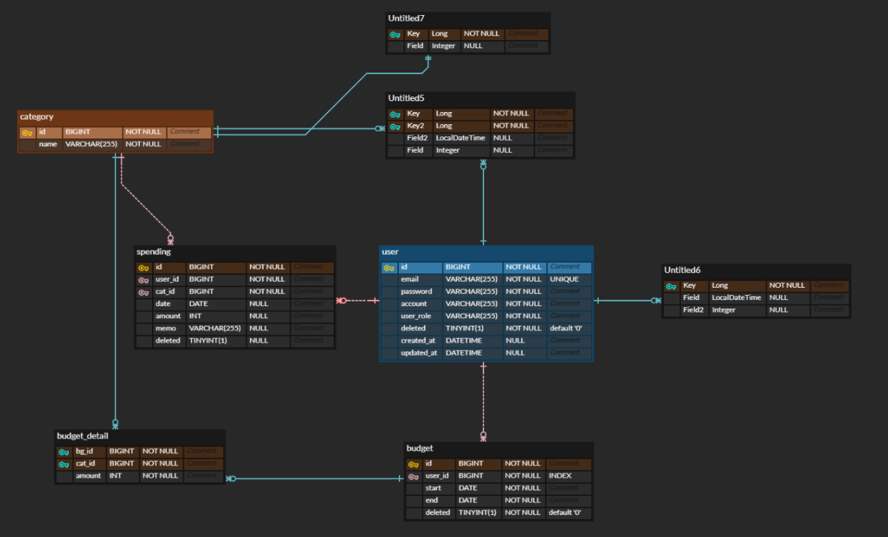

# 예산 매니저

## 목차
- [개요](#개요)
- [사용기술](#사용기술)
- [API 문서](#API-문서)
- [구현 기능](#구현기능)
- [시스템 구성도](#시스템-구성도)
- [ERD](#ERD)
- [TIL 및 회고](#프로젝트-관리-및-회고
  )

## 개요
본 서비스는 사용자들이 개인 재무를 관리하고 지출을 추적하는 데 도움을 주는 애플리케이션입니다.
이 앱은 사용자들이 예산을 설정하고 지출을 모니터링하며 재무 목표를 달성하는 데 도움이 됩니다.

## 사용기술

#### 개발환경
   
 
   
 
  

#### 배포환경
  
 
 

## API 문서
[-85EA2D?&logo=swagger&logoColor=white)](http://52.79.93.98:8080/swagger-ui/index.html#/)

| API Type           | Http Method | URL                               | Description     |
|--------------------|-------------|-----------------------------------|-----------------|
| **Auth API**       | POST        | `/api/v1/auth/token/access`       | 엑세스토큰 재발급       | 
| **User API**       | POST        | `/api/v1/users/sign-up`           | 회원가입            |
| **User API**       | POST        | `/api/v1/users/sign-in`           | 로그인             |
| **User API**       | POST        | `/api/v1/users/sign-out`          | 로그아웃            |
| **Category API**   | GET         | `/api/v1/categorys`               | 카테고리 리스트        |
| **Budget API**     | GET         | `/api/v1/budgets`                 | 사용자 예산 리스트      |
| **Budget API**     | GET         | `/api/v1/budgets/{bgId}`          | 사용자 예산 상세정보     |
| **Budget API**     | POST        | `/api/v1/budgets`                 | 사용자 예산 등록       |
| **Budget API**     | DELETE      | `/api/v1/budgets/{bgId}`          | 사용자 예산 삭제       |
| **Budget API**     | PATCH       | `/api/v1/budgets/{bgId}`          | 사용자 예산 업데이트     |
| **Budget API**     | PUT         | `/api/v1/budgets/detail/{bgId}`   | 사용자 예산 디테일 업데이트 |
| **Spending API**   | GET         | `/api/v1/spendings `              | 사용자 지출 목록 가져오기  |
| **Spending API**   | POST        | `/api/v1/spendings `              | 사용자 지출 기록 생성    |
| **Spending API**   | GET         | `/api/v1/spendings/{id} `         | 사용자 지출 기록 가져오기  |
| **Spending API**   | DELETE      | `/api/v1/spendings/{id} `         | 사용자 지출 기록 삭제    |
| **Statistics API** | GET         | `/api/v1/stats/{yyyy}/{MM}/{dd} ` | 사용자 하루 통계 가져오기  |
| **Statistics API** | PUT         | `/api/v1/stats/{yyyy}/{MM}/{dd} ` | 사용자 하루 통계 업데이트  |

## 구현기능

  
회원가입 및 로그인, 로그아웃 기능

- **구현 기능**  
    - 사용자 회원가입 및 로그인, 로그아웃 기능

- **구현 방법**  
    - 회원가입: 사용자 회원 양식을 받아 DB에 저장
    - 로그인: 사용자 로그인 양식을 받아 DB에 비밀번호와 비교한 후, Access Token, Refresh Token 발급
    - 로그아웃: 로그아웃 요청 시, Redis에 저장된 Refresh 토큰을 제거

  
Spring Security, JWT 토큰

- **구현 기능**  
    - Spring Security 와 JWT

- **구현 방법**  
    - 사용자 로그인 시, 발급한 Refresh Token을 Redis에 저장
    - Access Token 재발급 시, Redis에 저장된 사용자 Refresh Token과 비교
    - 로그아웃 시, Redis에서 발급한 Refresh Token 제거

  
카테고리 리스트 조회 기능

- **구현 기능**  
    - 카테고리 리스트 반환

- **구현 방법**  
    - 카테고리 조회 후 리스트 반환
    - Redis를 사용해 캐싱을 적용하였습니다.
    - Redis에 데이터가 존재하면 Redis에서 데이터를 반환하고 존재하지 않으면 DB에서 조회하여 Redis에 저장 후 데이터를 반환합니다.

  
사용자 예산 가져오기

- **구현 기능**  
    - 사용자가 설정한 예산 리스트를 반환

- **구현 방법** 
    - 사용자 아이디로 조회한 예산 리스트를 반환합니다.

  
사용자 예산 디테일 가져오기 기능

- **구현 기능**  
    - 사용자 예산의 상세정보를 조회합니다.

- **구현 방법** 
    - 사용자ID와 bgid로 사용자 예산 정보를 가져옵니다.

  
사용자 예산 등록/삭제/업데이트 기능

- **구현 기능**  
  - 사용자의 예산을 요청한 기능에 따라 수행합니다.

- **구현 방법** 
  - 사용자에게 받은 양식을 이용해 지출 기록을 CRUD 합니다.

  
사용자 예산 디테일 업데이트 기능

- **구현 기능**  
  - 사용자 예산의 상세정보를 업데이트합니다.

- **구현 방법** 
  - 사용자에게 받은 양식을 이용해 사용자 예산 디테일을 업데이트 합니다.

  
사용자 지출 목록 가져오기 

- **구현 기능**  
    - 사용자 지출 목록을 가져옵니다.

- **구현 방법** 
    - 사용자의 id와 조회 조건을 받아 QueryDSL로 조건 목록 조회를 진행합니다.
  

  
사용자 지출 기록 생성/삭제/업데이트 기능

- **구현 기능**  
    - 사용자의 지출 기록을 요청한 기능에 따라 수행합니다.

- **구현 방법** 
    - 사용자의 받은 양식을 이용해 지출 기록을 CRUD 합니다.

  
사용자 지출 기록 가져오기

- **구현 기능**  
    - 사용자가 선택한 지출 기록을 가져옵니다.

- **구현 방법** 
    - 사용자가 선택한 지출 id와 토큰 userid를 이용해 지출 기록을 조회합니다.

  
사용자 하루 통계 가져오기

- **구현 기능**  
  - 사용자가 선택한 하루 통계 기록을 가져옵니다.

- **구현 방법** 
  - 사용자가 선택한 날짜와 카테고리 리스트를 이용해 QueryDSL로 하루 통계를 조회합니다.

  
사용자 하루 통계 업데이트

- **구현 기능**  
  - 사용자가 선택한 하루 통계 기록을 업데이트 합니다.

- **구현 방법** 
  - 사용자가 선택한 날짜와 제출한 양식을 이용해 하루 통계를 업데이트 합니다
  - 기록이 없을 시, 새로 해당 날짜 기록을 만들고 업데이트 합니다.

## 시스템 구성도

## ERD

