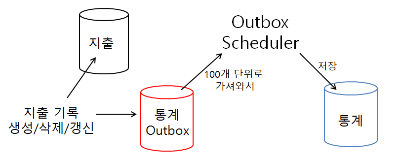
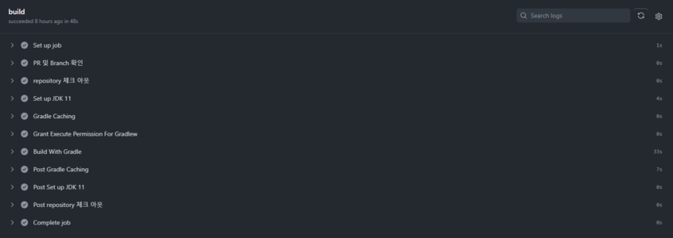
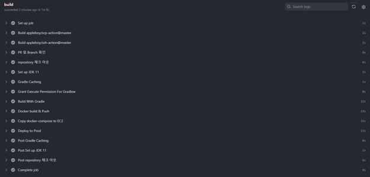
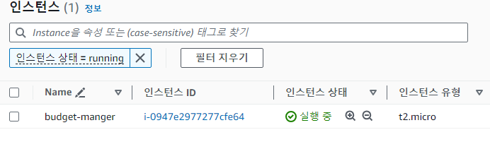
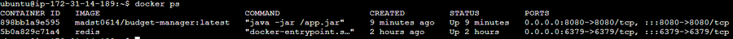
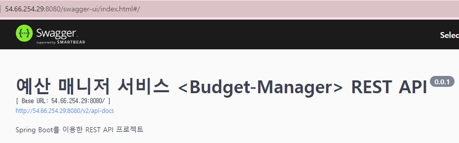

# 예산 매니저

## 목차
- [개요](#개요)
- [시스템 구성도](#시스템-구성도)
- [ERD](#ERD)
- [사용기술](#사용기술)
- [리뷰](#리뷰)
- [트러블슈팅 & 피드백](#트러블슈팅피드백)
- [느낀 점](#느낀점)
- [API 문서](#API-문서)
- [구현 기능](#구현기능)
- [배포](#배포)

## 개요
본 서비스는 사용자들이 개인 재무를 관리하고 지출을 추적하는 데 도움을 주는 애플리케이션입니다.
이 앱은 사용자들이 예산을 설정하고 지출을 모니터링하며 재무 목표를 달성하는 데 도움이 됩니다.

## 시스템 구성도

## ERD

## 사용기술
### Outbox Pattern

#### 개발
  
 
   
 
  

#### CI / CD
 
 
  
 

## 리뷰
### A. 통계
이번 프로젝트에서 가장 많은 고민을 한 기능입니다.  
매 요청마다 조인과 조건으로 지출 기록을 통계내서 기능을 제공하게 된다면 너무 비효율적이라고 판단했습니다.
이번 프로젝트에서는 합쳐져 있지만, 분산 서비스 환경에서 `지출 서비스`와 `통계 서비스`를 분리하여 사용하게 된다면
분산 트랜잭션 상황을 고려 해야 했고 결론적으로 `Outbox Pattern`을 사용하기로 결정했습니다  
지출 기록이 발생하면 해당 지출 기록을 저장하고  -> 통계 Outbox에 단순 저장하는 방식으로 Outbox Pattern을 구현했습니다.
현재는 Outbox Scheduler가 정해진 시간마다 Outbox Message를 처리하지만, Kafka 등 메세지 브로커를 사용하는 `Event Driven Architecture`에선 메세지 큐잉 모델을 사용하는 `Producer-Consumer` 형태로 구현하도록 확장할 수 있습니다.

### B. 배포
`도커 컴포즈`를 사용해서 Server 컨테이너와 Redis 컨테이너를 명령어 하나로 구축해봤습니다. `PR 요청`이 들어오면 `CI 검증`을 하고(현재 테스트는 제외) `main 브랜치에 Push` 되면 
Git Action 호스팅 환경에서 `빌드를 하고 이미지를 도커 허브에 배포`합니다. 이어 서버 환경에 깃 레포지트리의 `docker-compose.yml을 배포`하고 `docker-compose up` 하여 Continuous Deployment 환경을 구축했습니다. 

### C. 서비스
가장 많은 데이터 접근이 발생하는 기능은 `지출 기록`이라고 판단했습니다. 위에서 언급했다시피 지출 기능과 통계 기능이 결합되면 서비스 규모에 따라 성능 저하가 발생할 수 있으므로 이를 분리해서 구현했습니다.  
`지출이 발생`하면 `Outbox에 메세지`가 쌓이고 이를 `Scheduler가 정해진 시간마다 통계`에 갱신을 하는 방식을 사용했는데, 통계 하는 방식은 컨설팅 기능과 통계 기능에 따라 공통 기능으로 묶어서 구현했습니다.  
이렇게 묶인 기능은,   
첫 번째로 `한달 간 카테고리 별 지출 기록을 합산`하는 것   
두 번째는 `일일 간 카테고리 별 지출 기록을 합산`하는 것 입니다.  
일일 카테고리 별 기능을 통해서 한달 카테고리 별 지출 합산 기능을 제공할 순 있지만 한달 카테고리 별 지출 합산 기능 또한 빈번히 쓰이기에 따로 기능을 구현했습니다.  
이렇게 묶인 기능들을 통해 컨설팅 서비스와 통계 기능은 각각의 비즈니스 로직에 따라 해당 기능을 구현하게 됩니다.  
서비스 규모에 따라 일일 통계 기능과 한달 통계 기록을 분리해서 사용할 수 있으며 `Scale-out`에 유연하도록 설계하였습니다. 

## 트러블슈팅&피드백
### A. 트러블 슈팅
#### 1. Category 정합성 유지 
지출 기록 생성/갱신 할 때, Category 정합성에 대해 문제가 생겼습니다.
해결 방법은 1. Category Enum화 2. DB단에서 FK 처리(지출 TBL-카테고리 TBL) 3. 비즈니스 로직에서 검증  
세 가지로 도출되었습니다. 그 중 1번 Category Enum화는 타입 안정성은 높지만 카테고리를 추가 시에 매번 직접 코드를 수정해야 한다는 점에서 확장성에 용이하지 않다고 판단되었고  
2번 + 3번 방식으로 이중 검증을 통해 확장성과 서비스 안정성을 높였습니다.(카테고리는 Redis 서버에서 캐싱됩니다)

#### 2. AWS EC2 포트 차단
현재 사용하는 인터넷 회선이 AWS EC2 포트를 차단한다는 것을 알게 되었습니다.  
해결 방법은 1. 포트 우회 2. AWS Instance Connect Console 사용 이였고, 1번을 시도하였으나 좀 더 자세한 추가 조치(포트포워딩 or 인스턴스 SSH port 변경 등)가 필요하여 2번으로 프로젝트를 완성하였습니다.

#### 3. AWS EC2 인스턴스 시스템 환경 변수 설정
해당 프로젝트에서 사용한 EC2 인스턴스는 Ubuntu 환경으로 로그인/비로그인 + shell 종류별 / shell 상관없이 등 서버 환경에 따라 다양하게 환경변수를 생성할 수 있었습니다.  
해당 프로젝트 서버는 단일 서버로 내부에서 도커 컴포즈로 Server + Redis 형태로 구현하기에, 로그인/shell 종류 상관 없이 전체 서버 환경에서 적용하는 환경변수를 설정하는 방식, 즉/ etc/environment 에 환경 변수 추가하는 방식을 선정했습니다.

#### 4. 민감한 정보를 처리하는 방식 & 도커 컴포즈를 어떻게 처리할 것인가
Application-prod.yml에는 DB 연결 정보 등 민감 정보가 들어갈 수 있고 CI/CD 과정에서 Prod 서버에 접근하기에 이 정보들을 처리하는 방식이 필요했습니다.
깃 액션을 사용하기에 '깃 시크릿 변수'에 저장 하는 방식을 사용하고 Prod 서버에서 필요한 변수의 경우 해당 서버에서 '시스템 환경 변수'로 제공하기로 결정했습니다.  
Application.yml의 경우 Base 64로 전체를 인코딩 하여 깃 시크릿 변수에 넣는 방식이 있었지만 해당 정보가 수정될 때마다 깃 변수를 수정해야하므로 해당 개발 환경에서 시스템 변수 형태로 제공하기로 결정했습니다. 따라서 yml파일이 깃 레포지트리에 저장되며 민감 정보는 ${변수이름} 형태로 변경했습니다.  
도커 컴포즈 파일의 경우 해당 파일을 prod 서버 내에 저장하는 방식과 해당 파일을 레포지트리에 넣고 전달하는 방식이 있습니다. 두번째 방식이 코드 변경에 좀 더 유연하다고 생각은 들지만 안정성이나 보안은 첫번째 방식이 더 좋은 것 같습니다.  

#### 5. Application-prod.yml에서 시스템 환경 변수를 읽지 못하는 현상
해당 프로젝트는 도커 컴포즈로 Server 컨테이너와 Redis 컨테이너를 구축하여 서버를 구성했습니다. 깃 액션을 통해 CD 과정에서 Server가 제대로 동작하지 않는 현상을 확인하였고 해당 원인은 Server와 RDS가 연결되지 않아 발생한 문제 였습니다.  
제대로 연결되지 않은 원인은 Server 컨테이너 내부 application 설정에서 시스템 환경 변수를 읽지 못하는 현상이였고, docker compose up 시에 시스템 변수를 직접 읽어 Environment 변수로 해당 컨테이너에 매핑하는 방식으로 해결 했습니다. 

#### 6. Server 컨테이너가 RDS와 연결하지 못하는 현상
해당 현상은 원인을 찾지 못했습니다. 한가지 추측으론 잦은 CD 과정 속에 Docker 내부에 문제가 생기는 것으로 생각 됩니다. 해당 현상은 우분투 도커 전체 삭제 및 재설치로 서버 환경을 재구축하여 해결하였으며, 이와 관련하여 실제 서비스 prod 환경에선  '문제가 생긴 Server를 캐치하고 서비스 데이터를 보존하면서 빠르게 복구하는 자동화 시스템'과 해당 서비스를 이어가는 '백업 Server'가 필요하겠다 라는 생각이 들었습니다.

### B. 피드백
#### 1. 설계 부족 - 서비스 방향성 수정에 따른 Domain 수정
처음 서비스를 설계할때 Budget 기능은 사용자마다 start에서 end까지의 기간을 설정하는 방식이였습니다. 하지만 통계, 컨설팅 기능을 추가 함에 따라 유저들 간의 데이터 양식을 통일해야 하는 필요성이 생겼고
Budget 기간 설정을 월 단위로 처리하여 start와 end -> date(월 단위) 방식으로 바꿨습니다.  
그 과정에서 꽤 많은 코드 수정이 이루어 졌고, 실제 서비스 였다면 비용 또한 만만치 않겠다는 생각이 들었습니다.  
서비스 설계는 서비스 방향과 use case 고려와 기능 구현 등 모든 관점에서 충분히 고려하고 확장성과 유연성을 가져야 한다는 것을 다시금 깨달았습니다. 

#### 2. Budget 카테고리 별 예산의 유저 전체 평균 비율 기능의 아쉬움 
현재 해당 기능은 전체 유저의 Budget 전체 합을 전체 유저의 카테고리 별 합으로 나눠 비율을 제공 해줍니다. 해당 기능은 일부 유저의 거대한 예산에 따라 다른 유저들의 가중치가 적어질 수 있고 해당 통계 기능의 신뢰도가 떨어질 수 있습니다.  
따라서 해당 기능은 전체 유저의 유저 당 카테고리 별 예산 비율을 평균 내어 기능을 제공하는 방식이 더 좋다고 생각합니다.  
현재 통계 기능은 Outbox Pattern을 사용하여 갱신하기에 유저 Budget 카테고리별 예산에 변동이 생기면 해당 메세지를 Outbox에 저장하여 처리하는 방식으로 구현할 수 있습니다.

#### 3. CI 테스트 과정의 부재 & 서비스 종류별 개별 MSA 서버 구성 X
현재 프로젝트는 기한이 촉박 함에 따라 unit test 및 서비스 로직 검증 단계가 없습니다. CI 과정에서 자동화 테스트 단계가 없을 경우 서비스 안정성에 문제가 생길 수 있으므로 자동화 테스트 단계를 구축해야 합니다.  
현재 프로젝트 내 서비스는 모두 하나의 서버와 하나의 DB 에서 동작합니다. 서비스 구현을 하면서 User, Budget / Spending / Statistics 등 유사한 서비스를 묶어 각각의 서버와 DB를 구성할 수 있다는 생각이 들었습니다.  
또한 서비스 규모가 커지면 현재의 동기 아키텍처가 아니라 비동기 이벤트 아키텍처로 서버를 구현 해야된다는 생각이 들었습니다.  
이에 따라 일단은 관련 서비스 별로 묶어 최대한 분리하여 결합도를 낮추었고 서비스 아키텍처 변경에 따라 코드 수정이 최소화 될 수 있는 방향으로 구현했습니다.

## 느낀점
인턴쉽 제출 프로젝트인 'Recruit API'와 첫 번째 팀 프로젝트인 'sns-feed'에서 아쉬웠던 점을 최대한 보완하여 프로젝트를 구현했다.  
처음 Recruit API에서 도커를 사용해보았고 도커 이미지와 도커 컴포즈를 활용하지 못했는데 이번에 최대한 활용했다.  
첫 팀 프로젝트인 'sns-feed'에선 Spring JPA, Git, IntelliJ 등 다양한 스택을 배워 일 주일 내에 구현 해야 하는 촉박한 기한을 가져 통계 기능을 제대로 구현하지 못했다.  
이번 개인 프로젝트를 마무리 하면서 최대한 통계 부분에 신경 썼고 그 결과 대규모 서비스, 분산 서비스 환경에 대해 학습 하는 기회를 얻었다.  
다음 프로젝트 부터는 아마도 분산 서비스 기술적인 구현에 신경쓸듯 하고, 완성된 서비스는 앞으론 안만들 듯하다.  
기회와 시간이 된다면 대용량 DB에서 쿼리 성능 측정과 튜닝 해보는 과정을 해보고 대규모 분산 서비스 환경 에서 요청을 비동기 이벤트 메세지 브로커 방식으로 처리하는 과정을 학습하고 싶다.

## API 문서
[-85EA2D?&logo=swagger&logoColor=white)](http://52.79.93.98:8080/swagger-ui/index.html#/)

| API Type           | Http Method | URL                                     | Description          |
|--------------------|-------------|-----------------------------------------|----------------------|
| **Auth API**       | POST        | `/api/v1/auth/token/access`             | 엑세스토큰 재발급            | 
| **User API**       | POST        | `/api/v1/users/sign-up`                 | 회원가입                 |
| **User API**       | POST        | `/api/v1/users/sign-in`                 | 로그인                  |
| **User API**       | POST        | `/api/v1/users/sign-out`                | 로그아웃                 |
| **Category API**   | GET         | `/api/v1/categorys`                     | 카테고리 리스트 가져오기        |
| **Budget API**     | GET         | `/api/v1/budgets`                       | 사용자 예산 리스트           |
| **Budget API**     | GET         | `/api/v1/budgets/{bgId}`                | 사용자 예산 상세정보          |
| **Budget API**     | POST        | `/api/v1/budgets`                       | 사용자 예산 등록            |
| **Budget API**     | DELETE      | `/api/v1/budgets/{bgId}`                | 사용자 예산 삭제            |
| **Budget API**     | PUT         | `/api/v1/budgets/detail/{bgId}`         | 사용자 예산 디테일 업데이트      |
| **Spending API**   | GET         | `/api/v1/spendings `                    | 사용자 지출 목록 가져오기       |
| **Spending API**   | POST        | `/api/v1/spendings `                    | 사용자 지출 기록 생성         |
| **Spending API**   | GET         | `/api/v1/spendings/{id} `               | 사용자 지출 기록 가져오기       |
| **Spending API**   | DELETE      | `/api/v1/spendings/{id} `               | 사용자 지출 기록 삭제         |
| **Spending API**   | PATCH       | `/api/v1/spendings/{id} `               | 사용자 지출 기록 업데이트       |
| **Consulting API** | GET         | `/api/v1/consultings/recommend/today" ` | 오늘 지출 추천 가져오기        |
| **Consulting API** | GET         | `/api/v1/consultings/notice/today" `    | 오늘 지출 정보 가져오기        |
| **Statistics API** | GET         | `/api/v1/stats/rates/lastMonth `        | 사용자 지난 달 대비 소비율 가져오기 |
| **Statistics API** | GET         | `/api/v1/stats/rates/lastWeek `         | 사용자 지난 주 대비 소비율 가져오기 |
| **Statistics API** | GET         | `/api/v1/stats/rates/otherUsers-Me `    | 사용자 다른 유저 대비 소비율 가져오기 |
| **Statistics API** | GET         | `/api/v1/stats/budgetdetail/average `   | 모든 사용자 예산 평균 가져오기    |

## 구현기능

### A. 유저
#### 사용자 회원가입 (API)
- `계정명`, `패스워드`, `닉네임` 입력하여 회원가입을 할 수 있습니다.
#### 사용자 로그인 (API)
- `계정`, `비밀번호` 로 로그인 시 `JWT` 가 발급됩니다.
- 이후 모든 API 요청 Header 에 `JWT` 가 항시 포함되며, `JWT` 유효성을 검증합니다.

### B. 예산설정 및 설계
#### 카테고리
- 서비스 목적에 맞게 식비, 자유 등 지출 카테고리를 추가할 수 있습니다.
#### 카테고리 목록 (API)
- 유저가 예산설정에 사용할 수 있도록 모든 카테고리 목록을 반환합니다.

#### 예산 설정 (API)
- 해당 기간 별 설정한 `예산` 을 설정합니다. 예산은 `카테고리` 를 필수로 지정합니다.
  - ex) `식비` : 40만원, `교통` : 20만원
- 사용자는 언제든지 예산 정보를 변경할 수 있습니다.

#### 예산 설계  (API)
- 카테고리 별로 금액을 설정할 수 있습니다.
- 카테고리 별 예산 설정에 어려움이 있는 사용자를 위해 예산 비율 추천 기능을 제공합니다.
- Stats API로부터 `카테고리`별 평균 예산 비율을 응답 받아 프론트 단에서 처리합니다.
  - 유저들이 설정한 카테고리 별 예산을 통계하여, 평균 값을 제공합니다

### C. 지출 기록
#### 지출
- `지출 일시`, `지출 금액`, `카테고리` 와 `메모` 를 입력하여 생성합니다
#### 지출 CRUD (API)
- 지출을 `생성`, `수정`, `읽기(상세)`, `읽기(목록)`, `삭제` , `합계제외` 할 수 있습니다.
- `생성한 유저`만 위 권한을 가집니다.
- `읽기(목록)` 은 아래 기능을 가지고 있습니다.
  - 반드시 `기간` 으로 조회 합니다.
  - 특정 `카테고리`. `최소 ~ 최대` 금액 등 조건으로 검색이 가능합니다.
- `합계제외` 처리한 지출은 목록에 포함되지만, 모든 `지출 합계`에서 제외됩니다.

### D. 지출 컨설팅
#### 오늘 지출 추천(API)
- 설정한 `월별` 예산을 만족하기 위해 오늘 지출 가능한 금액을 `총액` 과 `카테고리 별 금액` 으로 제공합니다.
- 남은 기간에 분배하여 카테고리 별 금액을 추천합니다. 
- 예산을 넘기더라도 `최소 비율 금액`을 제공합니다.
#### 오늘 지출 안내(API)

- 오늘 지출한 내용을 `총액` 과 `카테고리 별 금액` 을 알려줍니다.
- `월별`설정한 예산 기준 `카테고리 별` 통계를 제공합니다.
  - `적정 금액` : 남은 일정 기준으로 오늘 사용했으면 적절했을 금액
  - `지출 금액` : 남은 일정 기준으로 오늘 사용한 금액
  - `위험도` : 카테고리 별 적정 금액, 지출금액의 비율을 %(퍼센테이지)로 나타냅니다.
    - ex) 오늘 사용하면 적당한 금액 10,000원/ 사용한 금액 20,000원 이면 200%

### E. 지출 통계
#### 지출 통계 (API)
- `지난 달` 대비 `총액`, `카테고리 별` 소비율.
  - 오늘이 10일차 라면, 지난달 10일차 까지 사용한 지출들을 비교하여 비율로 나타냅니다.
  - ex) `식비` 지난달 대비 150%
- `지난 요일` 대비 소비율
  - 오늘이 `월요일` 이라면 지난 `월요일`까지 소비한 지출들을 비교하여 비율로 나타냅니다.
  - ex) `월요일` 평소 대비 80%
- `다른 유저` 대비 소비율
  - 오늘 기준 다른 `유저` 가 예산 대비 사용한 평균 비율 대비 나의 소비율을 나타냅니다.
  - ex) 오늘 기준 다른 유저가 소비한 지출이 평균 50%이고 나는 60% 이면 120% 라면 `다른 사용자` 대비 120%

## 배포
### CI

### CD

### EC2

### docker

### RDS

### swagger
