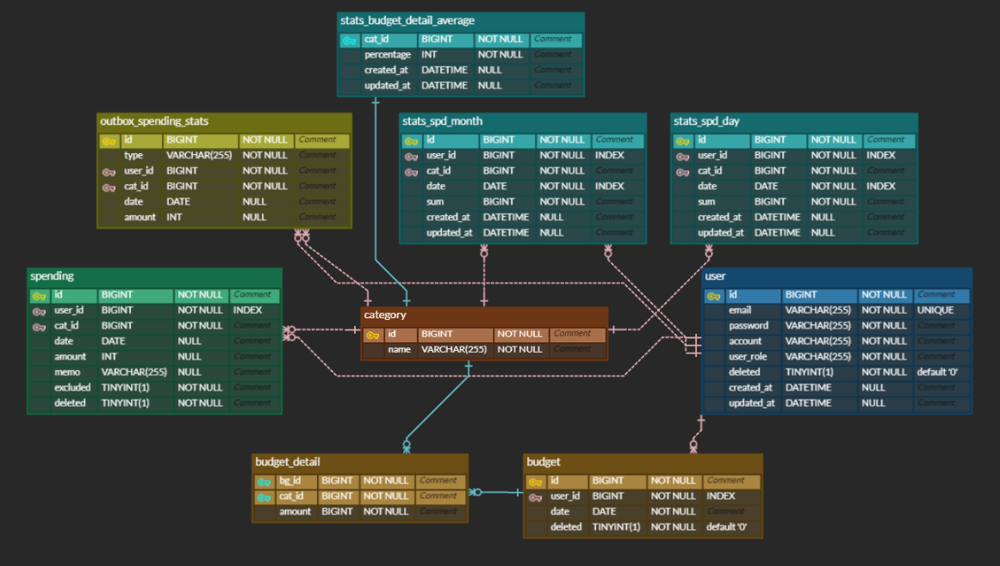
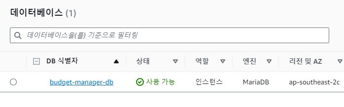

# 예산 매니저

## 목차
- [개요](#개요)
- [시스템 구성도](#시스템-구성도)
- [ERD](#ERD)
- [사용기술](#사용기술)
- [리뷰](#리뷰)
- [API 문서](#API-문서)
- [구현 기능](#구현기능)
- [배포](#배포)

## 개요
본 서비스는 사용자들이 개인 재무를 관리하고 지출을 추적하는 데 도움을 주는 애플리케이션입니다.
이 앱은 사용자들이 예산을 설정하고 지출을 모니터링하며 재무 목표를 달성하는 데 도움이 됩니다.

## 시스템 구성도

## ERD

## 사용기술
### Outbox Pattern

#### 개발
  
 
   
 
  

#### CI / CD
 
 
  
 

## 리뷰
### A. 통계
이번 프로젝트에서 가장 많은 고민을 한 기능입니다.  
매 요청마다 조인과 조건으로 지출 기록을 통계내서 기능을 제공하게 된다면 너무 비효율적이라고 판단했습니다.
이번 프로젝트에서는 합쳐져 있지만, 분산 서비스 환경에서 지출 서비스와 통계 서비스를 분리하여 사용하게 된다면
분산 트랜잭션 상황을 고려 해야 했고 결론적으로 Outbox Pattern을 사용하기로 결정했습니다  
지출 기록이 발생하면 해당 지출 기록을 저장하고  -> 통계 Outbox에 단순 저장하는 방식으로 Outbox Pattern을 구현했습니다.
현재는 Outbox Scheduler가 정해진 시간마다 Outbox Message를 처리하지만, Kafka 등 메세지 브로커를 사용하는 Event Driven Architecture에선 메세지 큐잉 모델을 사용하는 Producer-Consumer 형태로 구현하도록 확장할 수 있습니다.

### B. 배포
도커 컴포즈를 사용해서 Server 컨테이너와 Redis 컨테이너를 명령어 하나로 구축해봤습니다. PR 요청이 들어오면 CI 검증을 하고(현재 테스트는 제외) main 브랜치에 Push 되면 
Git Action 호스팅 환경에서 빌드를 하고 이미지를 도커 허브에 배포합니다. 이어 서버 환경에 깃 레포지트리의 docker-compose.yml을 배포하고 docker-compose up 하여 Continuous Deployment 환경을 구축했습니다. 

### C. 서비스
가장 많은 데이터 접근이 발생하는 기능은 지출 기록이라고 판단했습니다. 위에서 언급했다시피 지출 기능과 통계 기능이 결합되면 서비스 규모에 따라 성능 저하가 발생할 수 있으므로 이를 분리해서 구현했습니다.  
지출이 발생하면 Outbox에 메세지가 쌓이고 이를 Scheduler가 정해진 시간마다 통계에 갱신을 하는 방식을 사용했는데, 통계 하는 방식은 컨설팅 기능과 통계 기능에 따라 공통 기능으로 묶어서 구현했습니다.  
이렇게 묶인 기능은 첫 번째로 한달간 카테고리 별 지출 기록을 합산하는 것과 두 번째는 일일 카테고리 별 지출 기록을 합산해서 통계 내는 것 입니다.  
일일 카테고리 별 기능을 통해서 한달 카테고리 별 지출 합산 기능을 제공할 순 있지만 한달 카테고리 별 지출 합산 기능 또한 빈번히 쓰이기에 따로 기능을 구현했습니다.  
이렇게 묶인 기능들을 통해 컨설팅 서비스와 통계 기능은 각각의 비즈니스 로직에 따라 해당 기능을 구현하게 됩니다.  
서비스 규모에 따라 일일 통계 기능과 한달 통계 기록을 분리해서 사용할 수 있으며 Scale-out에 유연하도록 설계하였습니다. 

## API 문서
[-85EA2D?&logo=swagger&logoColor=white)](http://52.79.93.98:8080/swagger-ui/index.html#/)

| API Type           | Http Method | URL                                     | Description          |
|--------------------|-------------|-----------------------------------------|----------------------|
| **Auth API**       | POST        | `/api/v1/auth/token/access`             | 엑세스토큰 재발급            | 
| **User API**       | POST        | `/api/v1/users/sign-up`                 | 회원가입                 |
| **User API**       | POST        | `/api/v1/users/sign-in`                 | 로그인                  |
| **User API**       | POST        | `/api/v1/users/sign-out`                | 로그아웃                 |
| **Category API**   | GET         | `/api/v1/categorys`                     | 카테고리 리스트 가져오기        |
| **Budget API**     | GET         | `/api/v1/budgets`                       | 사용자 예산 리스트           |
| **Budget API**     | GET         | `/api/v1/budgets/{bgId}`                | 사용자 예산 상세정보          |
| **Budget API**     | POST        | `/api/v1/budgets`                       | 사용자 예산 등록            |
| **Budget API**     | DELETE      | `/api/v1/budgets/{bgId}`                | 사용자 예산 삭제            |
| **Budget API**     | PUT         | `/api/v1/budgets/detail/{bgId}`         | 사용자 예산 디테일 업데이트      |
| **Spending API**   | GET         | `/api/v1/spendings `                    | 사용자 지출 목록 가져오기       |
| **Spending API**   | POST        | `/api/v1/spendings `                    | 사용자 지출 기록 생성         |
| **Spending API**   | GET         | `/api/v1/spendings/{id} `               | 사용자 지출 기록 가져오기       |
| **Spending API**   | DELETE      | `/api/v1/spendings/{id} `               | 사용자 지출 기록 삭제         |
| **Spending API**   | PATCH       | `/api/v1/spendings/{id} `               | 사용자 지출 기록 업데이트       |
| **Consulting API** | GET         | `/api/v1/consultings/recommend/today" ` | 오늘 지출 추천 가져오기        |
| **Consulting API** | GET         | `/api/v1/consultings/notice/today" `    | 오늘 지출 정보 가져오기        |
| **Statistics API** | GET         | `/api/v1/stats/rates/lastMonth `        | 사용자 지난 달 대비 소비율 가져오기 |
| **Statistics API** | GET         | `/api/v1/stats/rates/lastWeek `         | 사용자 지난 주 대비 소비율 가져오기 |
| **Statistics API** | GET         | `/api/v1/stats/rates/otherUsers-Me `    | 사용자 다른 유저 대비 소비율 가져오기 |
| **Statistics API** | GET         | `/api/v1/stats/budgetdetail/average `   | 모든 사용자 예산 평균 가져오기    |

## 구현기능

### A. 유저
#### 사용자 회원가입 (API)
- `계정명`, `패스워드`, `닉네임` 입력하여 회원가입을 할 수 있습니다.
#### 사용자 로그인 (API)
- `계정`, `비밀번호` 로 로그인 시 `JWT` 가 발급됩니다.
- 이후 모든 API 요청 Header 에 `JWT` 가 항시 포함되며, `JWT` 유효성을 검증합니다.

### B. 예산설정 및 설계
#### 카테고리
- 서비스 목적에 맞게 식비, 자유 등 지출 카테고리를 추가할 수 있습니다.
#### 카테고리 목록 (API)
- 유저가 예산설정에 사용할 수 있도록 모든 카테고리 목록을 반환합니다.

#### 예산 설정 (API)
- 해당 기간 별 설정한 `예산` 을 설정합니다. 예산은 `카테고리` 를 필수로 지정합니다.
  - ex) `식비` : 40만원, `교통` : 20만원
- 사용자는 언제든지 예산 정보를 변경할 수 있습니다.

#### 예산 설계  (API)
- 카테고리 별로 금액을 설정할 수 있습니다.
- 카테고리 별 예산 설정에 어려움이 있는 사용자를 위해 예산 비율 추천 기능을 제공합니다.
- Stats API로부터 `카테고리`별 평균 예산 비율을 응답 받아 프론트 단에서 처리합니다.
  - 유저들이 설정한 카테고리 별 예산을 통계하여, 평균 값을 제공합니다

### C. 지출 기록
#### 지출
- `지출 일시`, `지출 금액`, `카테고리` 와 `메모` 를 입력하여 생성합니다
#### 지출 CRUD (API)
- 지출을 `생성`, `수정`, `읽기(상세)`, `읽기(목록)`, `삭제` , `합계제외` 할 수 있습니다.
- `생성한 유저`만 위 권한을 가집니다.
- `읽기(목록)` 은 아래 기능을 가지고 있습니다.
  - 반드시 `기간` 으로 조회 합니다.
  - 특정 `카테고리`. `최소 ~ 최대` 금액 등 조건으로 검색이 가능합니다.
- `합계제외` 처리한 지출은 목록에 포함되지만, 모든 `지출 합계`에서 제외됩니다.

### D. 지출 컨설팅
#### 오늘 지출 추천(API)
- 설정한 `월별` 예산을 만족하기 위해 오늘 지출 가능한 금액을 `총액` 과 `카테고리 별 금액` 으로 제공합니다.
- 남은 기간에 분배하여 카테고리 별 금액을 추천합니다. 
- 예산을 넘기더라도 `최소 비율 금액`을 제공합니다.
#### 오늘 지출 안내(API)

- 오늘 지출한 내용을 `총액` 과 `카테고리 별 금액` 을 알려줍니다.
- `월별`설정한 예산 기준 `카테고리 별` 통계를 제공합니다.
  - `적정 금액` : 남은 일정 기준으로 오늘 사용했으면 적절했을 금액
  - `지출 금액` : 남은 일정 기준으로 오늘 사용한 금액
  - `위험도` : 카테고리 별 적정 금액, 지출금액의 비율을 %(퍼센테이지)로 나타냅니다.
    - ex) 오늘 사용하면 적당한 금액 10,000원/ 사용한 금액 20,000원 이면 200%

### E. 지출 통계
#### 지출 통계 (API)
- `지난 달` 대비 `총액`, `카테고리 별` 소비율.
  - 오늘이 10일차 라면, 지난달 10일차 까지 사용한 지출들을 비교하여 비율로 나타냅니다.
  - ex) `식비` 지난달 대비 150%
- `지난 요일` 대비 소비율
  - 오늘이 `월요일` 이라면 지난 `월요일`까지 소비한 지출들을 비교하여 비율로 나타냅니다.
  - ex) `월요일` 평소 대비 80%
- `다른 유저` 대비 소비율
  - 오늘 기준 다른 `유저` 가 예산 대비 사용한 평균 비율 대비 나의 소비율을 나타냅니다.
  - ex) 오늘 기준 다른 유저가 소비한 지출이 평균 50%이고 나는 60% 이면 120% 라면 `다른 사용자` 대비 120%

## 배포
### CI

### CD

### EC2

### docker

### RDS

### swagger

