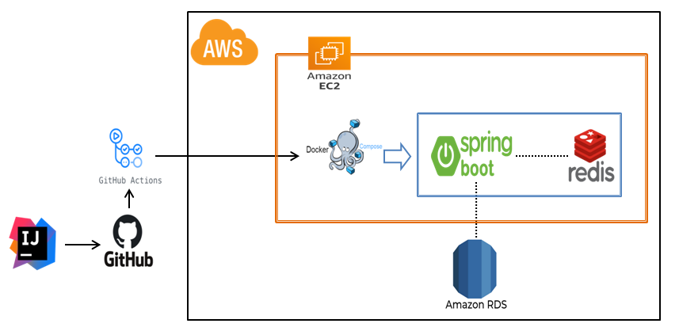

# 예산 매니저

## 목차
- [개요](#개요)
- [사용기술](#사용기술)
- [API 문서](#API-문서)
- [구현 기능](#구현기능)
- [시스템 구성도](#시스템-구성도)
- [ERD](#ERD)
- [TIL 및 회고](#프로젝트-관리-및-회고
  )

## 개요
본 서비스는 사용자들이 개인 재무를 관리하고 지출을 추적하는 데 도움을 주는 애플리케이션입니다.
이 앱은 사용자들이 예산을 설정하고 지출을 모니터링하며 재무 목표를 달성하는 데 도움이 됩니다.

## 사용기술

#### 개발환경
   
 
   
 
  

#### 배포환경
  
 
 

## API 문서
[-85EA2D?&logo=swagger&logoColor=white)](http://52.79.93.98:8080/swagger-ui/index.html#/)

| API Type            | Http Method | URL                                  | Description     |
|---------------------|-------------|--------------------------------------|-----------------|
| **Auth API**        | POST        | `/api/v1/auth/token/access`          | 엑세스토큰 재발급       | 
| **User API**        | POST        | `/api/v1/users/sign-up`              | 회원가입            |
| **User API**        | POST        | `/api/v1/users/sign-in`              | 로그인             |
| **User API**        | POST        | `/api/v1/users/sign-out`             | 로그아웃            |
| **Category API**    | GET         | `/api/v1/categorys`                  | 카테고리 리스트        |
| **Budget API**      | GET         | `/api/v1/budgets`                    | 사용자 예산 리스트      |
| **Budget API**      | GET         | `/api/v1/budgets/{bgId}`             | 사용자 예산 상세정보     |
| **Budget API**      | POST        | `/api/v1/budgets`                    | 사용자 예산 등록       |
| **Budget API**      | DELETE      | `/api/v1/budgets/{bgId}`             | 사용자 예산 삭제       |
| **Budget API**      | PATCH       | `/api/v1/budgets/{bgId}`             | 사용자 예산 업데이트     |
| **Budget API**      | PUT         | `/api/v1/budgets/detail/{bgId}`      | 사용자 예산 디테일 업데이트 |

## 구현기능

  
회원가입 및 로그인, 로그아웃 기능

- **구현 기능**  
    - 사용자 회원가입 및 로그인, 로그아웃 기능

- **구현 방법**  
    - 회원가입: 사용자 회원 양식을 받아 DB에 저장
    - 로그인: 사용자 로그인 양식을 받아 DB에 비밀번호와 비교한 후, Access Token, Refresh Token 발급
    - 로그아웃: 로그아웃 요청 시, Redis에 저장된 Refresh 토큰을 제거

  
Spring Security, JWT 토큰

- **구현 기능**  
    - Spring Security 와 JWT

- **구현 방법**  
    - 사용자 로그인 시, 발급한 Refresh Token을 Redis에 저장
    - Access Token 재발급 시, Redis에 저장된 사용자 Refresh Token과 비교
    - 로그아웃 시, Redis에서 발급한 Refresh Token 제거

  
카테고리 리스트 조회 기능

- **구현 기능**  
    - 카테고리 리스트 반환

- **구현 방법**  
    - 카테고리 조회 후 리스트 반환

  
사용자 예산 리스트 조회 기능

- **구현 기능**  
    - 사용자가 설정한 예산 리스트를 반환

- **구현 방법** 
    - 사용자 아이디로 조회한 예산 리스트를 반환합니다.

  
사용자 예산 상세 정보 조회 기능

- **구현 기능**  
    - 사용자 예산의 상세정보를 조회합니다.

- **구현 방법** 
    - 사용자ID와 bgid로 사용자 예산 정보를 가져옵니다.
    - fetch join을 사용해 한번에 하위 항목까지 모두 조회합니다.
    - Redis를 사용해 캐싱을 적용하였습니다.
    - Redis에 데이터가 존재하면 Redis에서 데이터를 반환하고 존재하지 않으면 DB에서 조회하여 Redis에 저장 후 데이터를 반환합니다.

  
리뷰 등록 기능

- **구현 기능**  
    - 리뷰를 등록합니다.

- **구현 방법** 
    - 평점과 리뷰 내용을 등록합니다.
    - 리뷰 등록시 맛집의 평점과 리뷰수를 업데이트 합니다.
    - 리뷰 등록시 Redis에 캐싱되어있는 해당맛집의 데이터를 삭제하여 최신화되도록 했습니다.

  
식당 정보 가져오는 스케쥴링

- **구현 기능**  
    - 식당 정보 가져오는 스케쥴링 기능 구현

- **구현 방법**  
    - 총 5개 외부 api를 호출합니다.(경기도 일반음식점 _ 패스트푸드,중식,양식,뷔페,일식)
    - 모든 값을 그대로 저장하되 null값은 데이터 타입에 따라 `데이터없음`, `0` , `0.0` 으로 전처리
    - 유일키는 식당이름+지번주소 에 공백을 제거하여 사용
    - 폐업상태 식당의 경우 저장하지 않음.
    - 매일 `23:59` 스케줄링 동작
    - 저장시점에 저장 식당 종류, 시간을 로깅
    - 이미 저장된 식당의 경우 업데이트 진행

  
점심추천에 동의한 고객들에게 메세지 전송하는 기능

- **구현 기능**  
    - 점심추천에 동의한 고객들에게 메세지 전송하는 기능 추가

- **구현 방법**  
    - 점심약속에 동의한 고객들의 목록을 조회
    - 고객의 좌표에 가까우며 별점이 가장높은 5개 카테고리의 식당 5개씩, 총 25개 조회(`QueryDSL`,하버사인 공식 사용)
    - 5개씩 한 `embed`에 묶어 `DiscordWebhook` 으로 전송할 메세지 객체 생성
    - 조회된 고객순서대로 메세지 전송 `DiscordWebhook` 호출
        - 메시지 예시(각 카테고리별 5개씩)
          > 오늘의 추천 일식
           <strong>산(뼈찜,뼈곰탕)</strong>
           경기도 평택시 탄현로1번길 11, 101,102호 (장당동, 엘림하우스)
            <strong>스고이</strong>
            경기도 평택시 고덕갈평7길 10, 1층 (고덕동)
            <strong>광명회수산</strong>
            경기도 평택시 현촌4길 2-33, 101호 (용이동)
            <strong>오늘은참치</strong>
            경기도 시흥시 옥구천동로 449, 부성파스텔아파트 상가동 1층 105호 (정왕동)
            <strong>장군수산</strong>
            경기도 오산시 오산로160번길 5-6, 102,103,104호 (원동, 건정프라자)

  
시군구 데이터를 csv파일로 업데이트하는 기능

- **구현 기능**  
    - 시군구 데이터를 `.csv`파일로 업데이트하는 기능 추가
    - 시군구 데이터양식 `.csv`파일을 다운로드하는 기능 추가

- **구현 방법**  
    - **파일업로드** 
      a. 각 라인이 null이 아닐때까지 읽어 가며 각 셀을 "," 로 구분하여 배열로 변환 
      b. 배열의 각 요소로 SggLatLon 객체를 생성해 저장 
      c. 예외 발생시 로그 적재
    - **파일다운로드**  
      a. 도,시,위도,경로 로 이루어진 양식을 생성 
      b. 해당파일을 InputStream으로 변환 
      c. InputStream을 다시 InputStreamResource로 변환 
      d. sgg-template.csv 파일 반환

  
시군구 목록 조회 기능

- **구현 기능**  
    - 시군구 목록 조회기능 추가 (캐싱 적용)

- **구현 방법**  
    - 성능 개선 및 동시성 처리 목적으로 캐싱 적용.
    - 만료일은 1일, 키는 `String`으로 직렬화, 값은 `Json`으로 직렬화
    - 필요한 메서드에서 어노테이션을 사용해 캐싱 진행
    - 시군구 목록을 조회해오는 기능을 추가 (캐싱적용 `@Cacheable`,`@CacheEvict`)
    - 해당 캐시는 1일 유효하며 만약 CSV파일이 업로드 될 시 캐시 초기화

  
CI 구축

- **구현 기능**  
    - Github Actions를 통해 main의 pr과 push, dev의 pr 생성시 빌드, 테스트 자동화

- **구현 방법** 

  
CD 구축

- **구현 기능**  
    - main branch의 push 동작이 발생하면, aws 인증 후 s3를 통해 배포

- **구현 방법** 
    - CodeDeploy를 통해 배포 자동화

    - 위 설정을 통해 jar 파일 실행
    

## 시스템 구성도

## ERD

